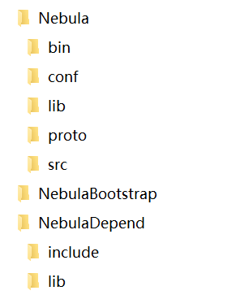

English | [中文](/README_cn.md)
# Nebula : An event driven asynchronous C++ framework
    

1. [Overview](#Overview)
2. [License](#License)
3. [Building](#Building)
4. [Documentation](#Documentation)
5. [Depend on](#DependOn)
6. [Todo list](#TODO)
7. [Change log](#ChangeLog)

## Overview 

Nebula is an event-driven TCP protocol network framework developed in C++ language. It supports multiple application layer communication protocols including proto3, http, https, and websocket. The purpose of developing the Nebula framework is to provide a fast and high-performance distributed service cluster based on C++.

Nebula can be used as a single high-performance TCP server, but building a cluster based on Nebula can truly reflect its value. In order to quickly build distributed service clusters, Nebula Bootstrap cluster solutions including various types of services have been developed. For details on NebulaBootstrap, please refer to [NebulaBootstrap](https://github.com/Bwar/NebulaBootstrap).

## License 

MIT License

>  Copyright (c) 2018 Bwar
>
>  Permission is hereby granted, free of charge, to any person obtaining a copy
>  of this software and associated documentation files (the "Software"), to deal
>  in the Software without restriction, including without limitation the rights
>  to use, copy, modify, merge, publish, distribute, sublicense, and/or sell
>  copies of the Software, and to permit persons to whom the Software is
>  furnished to do so, subject to the following conditions:
>
>  The above copyright notice and this permission notice shall be included in
>  all copies or substantial portions of the Software.
>
>  THE SOFTWARE IS PROVIDED "AS IS", WITHOUT WARRANTY OF ANY KIND, EXPRESS OR
>  IMPLIED, INCLUDING BUT NOT LIMITED TO THE WARRANTIES OF MERCHANTABILITY,
>  FITNESS FOR A PARTICULAR PURPOSE AND NONINFRINGEMENT. IN NO EVENT SHALL THE
>  AUTHORS OR COPYRIGHT HOLDERS BE LIABLE FOR ANY CLAIM, DAMAGES OR OTHER
>  LIABILITY, WHETHER IN AN ACTION OF CONTRACT, TORT OR OTHERWISE, ARISING FROM,
>  OUT OF OR IN CONNECTION WITH THE SOFTWARE OR THE USE OR OTHER DEALINGS IN
>  THE SOFTWARE.

## Building 
   Nebula was builded passing with gcc6.4 on centos6.5(upgrade binutils to 2.22 or later) and centos7.4.  
   

   build step：
   1. $ mkdir NebulaDepend
   2. go to [Depend on](#DependOn), download and compile these dependent libraries, copy the shared library files to NebulaDepend/lib, copy the header files directory to NebulaDepend/include.
   3. $ cd Nebula/src;    $ make

## Documentation 
   The complete documentation for Nebula is available: [Nebula documentation](https://github.com/Bwar/Nebula/wiki)
    

## Depend on 
   * [protobuf](https://github.com/google/protobuf)
   * [libev](http://software.schmorp.de/pkg/libev.html) or [libev](https://github.com/kindy/libev)
   * [hiredis](https://github.com/redis/hiredis)
   * [crypto++](http://www.cryptopp.com)
   * [http_parse](https://github.com/nodejs/http-parser) integrate into Nebula/src/util/http 
   * [CJsonObject](https://github.com/Bwar/CJsonObject) integrate into Nebula/src/util/json

## Todo list 
   - June 2018:    https support.
   - Auguest 2018: ipv6 support.
   - October 2018: coroutine support.

## Change log 
#### v0.3
   - rewrite with C++14
   - create actors by reflection (using template)
   - add distributed trace log
#### v0.2
   - the first runable version

 

