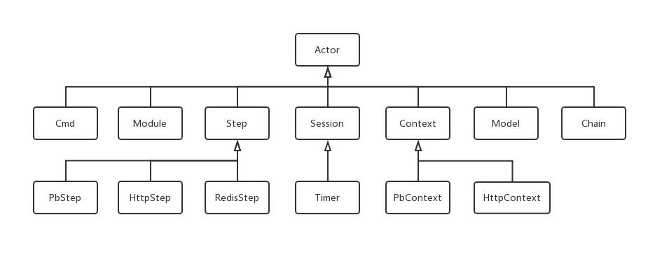

### Nebula中的Actor组件

&emsp;&emsp;Nebula是一个面向业务的IoC网络框架，面向业务是Nebula区别于常见网络框架的最大特点之一，之所以说是面向业务是因为Nebula提供了快速开发的组件，有了这些组件，业务开发效率非常高，同时这些组件也规范和统一了业务开发代码，提高代码可读性，加强团队交流。只需掌握Actor的应用就足以利用Nebula框架开发出高性能的分布式服务，而掌握Actor的应用又是非常简单的事情。


### Actor由来

&emsp;&emsp;也许有人听说过Actor模型，甚至可能有人非常熟悉Actor模型。Actor模型是处理并行计算的概念模型，它定义了系统部件行为和交互的一些规则。跟共享数据方式的并发编程相比，基于消息传递机制的Actor模型最大的优点就是不会产生数据竞争状态，不用处理让人十分头痛的各种锁问题。使用这个模型的最著名的编程语言是Erlang和Elixir，Scala语言鼎鼎有名的Akka库也是使用Actor模型。


&emsp;&emsp;Nebula的Actor组件不是从Erlang或Akka等借鉴过来的Actor模型。Nebula的前身Starship框架先有了Cmd、Step和Session三个组件，开始编写Nebula时在三个组件之上再抽象了一层就有了Actor。Nebula的Actor跟Actor模型的Actor可能有一定相似之处，那纯属偶然，作者在写Nebula之前对Actor没有了解。

### Actor概览

&emsp;&emsp;Actor组件的讲解是将Actor应用与Actor组件定义穿插着进行的，这样比先逐个定义讲完再讲应用之理解起来要容易，并且不会枯燥。先来简单了解Actor组件全貌：



&emsp;&emsp;Nebula是一个IoC网络框架，开发者只需熟悉Actor相关的类无须对了解整个框架即可开发出分布式服务，对应用开发者而言开发更高效，这是Proactor模式的Nebula框架跟许多其他网络框架不太一样的地方。

&emsp;&emsp;所有业务逻辑均抽象成事件和事件处理，Actor为事件处理者。Actor是所有Actor派生类与Nebula框架的媒介，在框架应用和业务逻辑开发中有至关重要的作用，这在后续会详细讲解，暂且先理解为Actor是所有功能组件的基类。


&emsp;&emsp;Actor为事件（消息）处理者，所有业务逻辑均抽象成事件和事件处理，Actor分为Cmd、Module、Step、Session、Context、Model、Chain七种不同类型。 业务逻辑代码均通过从除Chain之外的六种不同类型事件处理者派生子类来实现，专注于业务逻辑实现，而无须关注业务逻辑之外的东西。Nebula的前身Starship只有Cmd、Module、Step、Session四种组件，却已成功应用于一个生产环境的IM，这些组件的理解和应用都很容易，Nebula虽然增加了几种组件，但只带来了方便而没增加复杂性。Actor类自身提供各组件与框架交互的成员函数，通过这些成员函数即可完成所有业务逻辑所需的功能，换句话说，基于Nebula框架的业务开发只需了解Actor类的30余成员函数的功能是什么就足够，门槛低到难以想象。


&emsp;&emsp;Cmd为业务逻辑入口，对应通信协议MsgHead中的cmd命令字，用于选择对应处理逻辑类。一些知名框架把Handler做成一个处理链，一个event过来顺着这个处理链顺序传递，相应的Handler处理完后调用下一个Handler处理，与event无关的Handler收到event时什么都不做就直接调用下一个Handler处理。与之不同的是，Nebula把所有Cmd（Handler）放在一个HashMap里，当收到Msg（event）时，根据cmd命令字（event type）直接交给对应的Cmd类处理，每个事件只会有一个处理者，如果需要多个处理者那就是对应Cmd内部的事情，可以通过Step、Model等组成一条处理链（后续章节会有说明）。与一些框架把编解码器作为Handler的一种加到Handler链里不同，Nebula的Codec编解码器不属于Cmd也不属于Actor，因此也不属于处理链的一部分。Codec会在编解码器章节说明，不在Actor组件这里说明。


&emsp;&emsp;Module跟Cmd的作用完全相同，差异只在于Cmd与MsgHead里的cmd命令字对应，Module与HttpMsg里的url_path对应。理解了Cmd也就等于理解了Module。


&emsp;&emsp;Step是最为核心的Actor组件，Nebula高性能的关键在于Step，IO密集型应用的逻辑都是围绕Step展开，暂且先把Step理解为一个操作步骤。Step起到C语言中异步回调函数的作用，却又比异步回调函数适用要简单得多，事实上Step底层就是通过异步回调函数实现的，只是复杂的事情由Nebula框架完成了，留给应用开发者的是较为简单的Step。Step与future、promise异步实现方式也完全不同，许多号称支持同步、异步、半同步的rpc框架采用的都是future、promise。

&emsp;&emsp;Session是仅次于Step的核心Actor组件，用于保存状态和数据。Cmd、Step等其他Actor组件也可以用Session来传递数据。在一些实时数据流应用中（比如[Nebio](https://github.com/Bwar/Nebio)）也适合把Session作最主要的组件使用。

&emsp;&emsp;Context为上下文数据组件，用于有上下文关系的Actor之间传递数据。与Session在传递数据上的区别在于，Context仅用于有强依赖的上下文之间传递，且传递效率和方便性高于Session。

&emsp;&emsp;Model为模型和计算组件。

&emsp;&emsp;Chain为动态调用链管理组件，用于运行时动态管理Step和Model的调用。用Chain管理的调用链除了可动态变化之外，还更为方便，更直观。

&emsp;&emsp;Actor组件各有各的用途和适用场景，灵活应用这些组件可以满足绝大多数业务需求，这是Nebula号称面向业务的IoC网络框架的根本。同时也因Actor组件设计比较精妙，有些作用可能连Nebula框架设计者也没有发现，有待应用开发者们发掘。当然，发现新的用途并不意味着滥用，与官方文档相悖的用途建议不要使用。