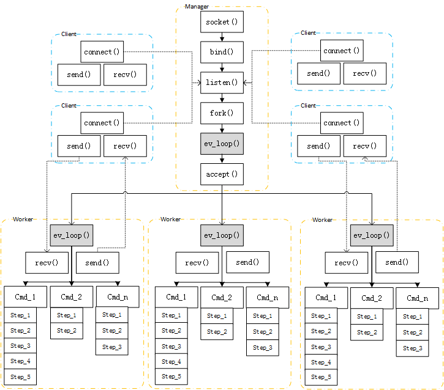

&emsp;&emsp;Nebula框架基于libev事件驱动，可以类比java的netty。

&emsp;&emsp;Labor为进程处理者，有两个实体类Manager和Worker，进程级资源都由Labor进行管理和调度。

&emsp;&emsp;Actor为事件（消息）处理者，所有业务逻辑均抽象成事件和事件处理，Actor分为Cmd、Module、Step、Session等不同类型。业务逻辑代码均通过从这四种不同类型时间处理者派生子类来实现，专注于业务逻辑实现，而无须关注业务逻辑之外的东西。

&emsp;&emsp;Channel为通信通道，所有消息均通过Channel进行收发，Channel都是非阻塞的，由Labor调用Channel的方法进行消息发送和接收。消息的编解码由Codec完成，每个Channel创建时均同步创建一个Codec并绑定，在发生应用层通信协议变更时，通过切换Channel的Codec来完成同一通道的不同协议编解码。

&emsp;&emsp;Nebula的进程模型如上图所示，由管理进程与工作进程组成。启动时引导程序先创建管理进程，管理进程读取配置文件，加载业务插件，然后绑定IP、监听端口、拉起配置文件中指定数量的工作进程。

&emsp;&emsp;管理进程负责监控和管理工作进程，与注册中心通信上报当前节点信息，接收其他节点信息，配置下发，接收新连接并将连接文件描述符传送给工作进程。

&emsp;&emsp;工作进程负责数据收发和处理。

&emsp;&emsp;管理进程与工作进程之间通过两个（控制流与数据流分开）UnixSocket进行通信。
