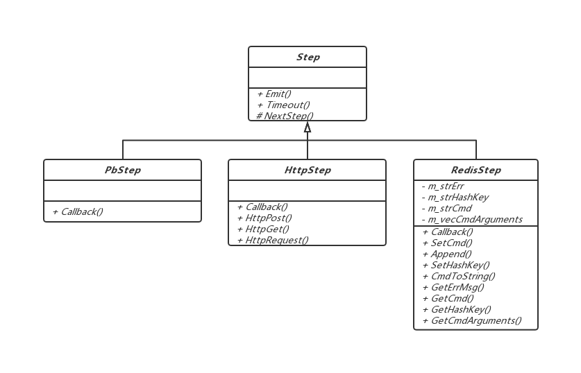
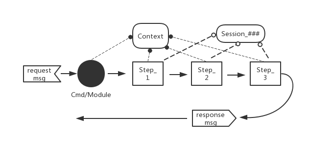
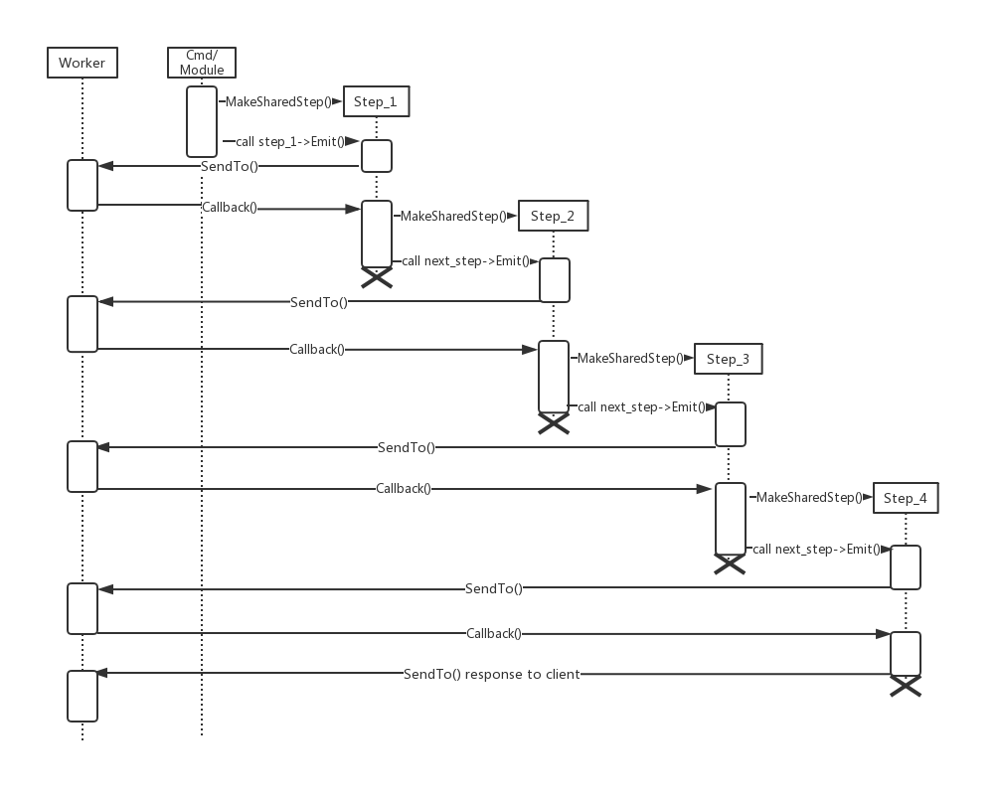
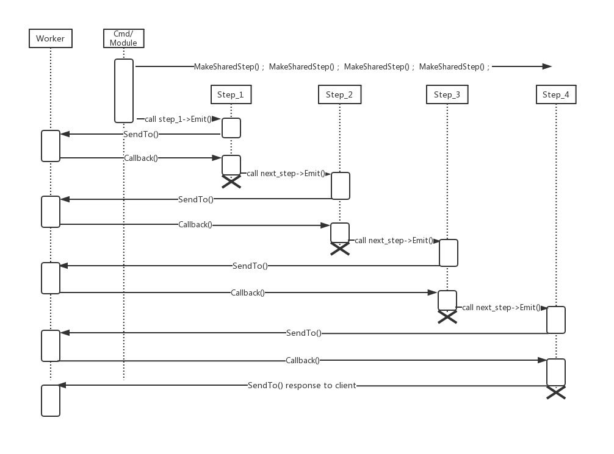
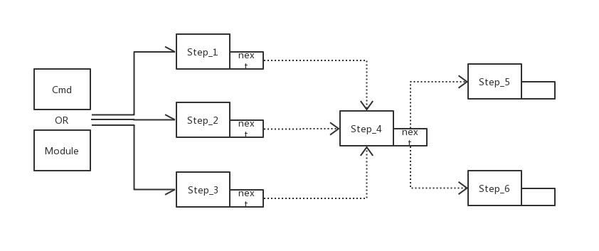
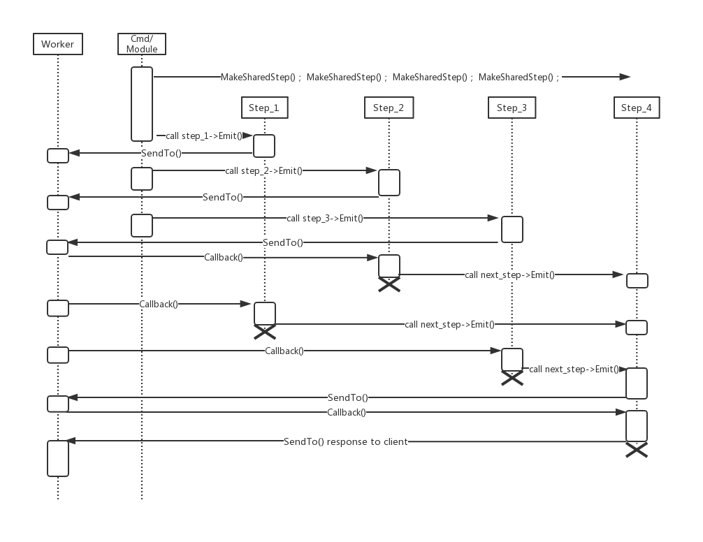

### Step定义
&emsp;&emsp;Step是最为核心的Actor组件，Nebula高性能的关键在于Step，IO密集型应用的逻辑都是围绕Step展开，暂且先把Step理解为一个操作步骤。Step起到C语言中异步回调函数的作用，却又比异步回调函数使用要简单得多。首先来看一下Step类图：



&emsp;&emsp;如图所示，Step类分为三种PbStep、HttpStep和RedisStep，分别用在需要Nebula通信协议、Http通信协议和Redis通信协议的场景，其中PbStep应用最多，文档中的Step示例以PbStep为主。

Step.hpp:

```C++
#include "labor/Worker.hpp"
#include "actor/Actor.hpp"
#include "actor/DynamicCreator.hpp"

namespace neb
{

class Chain;

class Step
{
public:
    Step(Actor::ACTOR_TYPE eActorType, std::shared_ptr<Step> pNextStep = nullptr, ev_tstamp dTimeout = gc_dDefaultTimeout);
    Step(const Step&) = delete;
    Step& operator=(const Step&) = delete;
    virtual ~Step();

    /**
     * @brief 提交，发出
     * @note 注册了一个回调步骤之后执行Emit()就开始等待回调。
     */
    virtual E_CMD_STATUS Emit(int iErrno = ERR_OK, const std::string& strErrMsg = "", void* data = NULL) = 0;

    /**
     * @brief 步骤超时回调
     */
    virtual E_CMD_STATUS Timeout() = 0;

protected:
    /**
     * @brief 执行当前步骤接下来的步骤
     */
    void NextStep(int iErrno = ERR_OK, const std::string& strErrMsg = "", void* data = NULL);

    uint32 GetChainId() const
    {
        return(m_uiChainId);
    }

private:
    ...
};

} /* namespace neb */
```

&emsp;&emsp;首先来看Step最重要最核心的两个函数Emit()和Callback()。Emit()用于发出网络IO，在发出IO前做开发者所需要的业务逻辑处理，包括组装用于向网络发出的数据包。Callback()在从Emit()发出的网络请求得到响应时由框架回调，响应数据通过Callback()的参数传递进来。

### Step是如何提高并发的

&emsp;&emsp;CPU与内存的速度远高于磁盘和网络，对IO密集型的应用而言，大部分时间消耗在IO等待上。把一次业务逻辑处理过程的CPU处理时间和IO等待时间放在一条时间轴上，CPU处理是时间轴上的一个个点，而IO等待是时间轴上的一个个线段。在多线程同步的处理模型里，是把一个个线段用其他线程处理了，在业务主线程里留下一个个点，一条时间轴可以排布非常多的点，并发量也就被提高了。然而，线程数量并不是越多越好的，线程有调度代价，当到了某个线程数量时，再增加线程数可能不仅不会提高并发量，反而会降低并发。事件驱动是在不增加线程的情况下把一个个线段移除出去只留下一个个点，理论上一条时间轴（一秒也可以看成一条时间轴）上可以排布多少个点并发就有多大。把线段从处理时间轴移除只保留两个端点只是为其他点腾出空间（时间），而不是把线段所需时间给消化掉了，所以事件驱动不会降低单个请求的处理时间，只是降低了请求之间相互等待的时间，可近似看作请求与请求之间无等待。

&emsp;&emsp;Step的Emit()和Callback()就是线段上的两个端点，Emit()和Callback之间的线段是IO等待时间，通过Step把这段时间移除出去只保留了Emit()和Callback()两个端点，Nebula实现了单个服务进程的高并发。Emit()和Callback()是Step最重要的两个函数，Emit()在Step中定义，Callback()因为参数不同分别在PbStep、HttpStep、RedisStep中定义，两个函数都是纯虚函数。Step还有一个纯虚函数Timeout()用于超时回调，当Emit()执行发出网络请求后超过指定超时时间未收到响应，Timeout()将会被调用。Step的派生类应选择从PbStep、HttpStep、RedisStep其中之一派生。

### Step调用链

&emsp;&emsp;一次客户端请求，服务端往往需要不止一次网络IO才能完成对客户端的服务，多次网络IO就有多个Step，多个Step有调用的先后顺序构成了Step调用链。Step调用链分为静态调用链和动态调用链。__静态调用链__是代码写完之后，调用顺序就固定下来了，哪怕有if条件或switch开关控制走不同的调用链分支也只是多了几个固定的调用顺序可以选择，从根本上说调用顺序就是已经固定下来了，这种调用链称为静态调用链。静态调用链的特点是调用顺序完全由编写Step业务代码的开发人员决定，想定义成什么样的调用顺序就写什么样的代码，框架是完全不会介入静态调用链的调用顺序，不会在一个Step执行完毕后自动调用它的NextStep()。__动态调用链__指的是通过配置文件将一系列相关（需要用到同一个Context或Session上下文）但又没有固定顺序（既没有在代码中制定NextStep，又没有在Step代码中创建Step并执行Emit（））的Step动态配置成调用链。动态调用链的特点是灵活，可以根据业务需要随时调整调用顺序。

&emsp;&emsp;静态调用链在Step的下文中有详细说明，动态调用链的使用在Chain组件的章节里说明。

### 构造Step

&emsp;&emsp;回过头来看看Step的构造函数：

```C++
Step(Actor::ACTOR_TYPE eActorType, std::shared_ptr<Step> pNextStep = nullptr, ev_tstamp dTimeout = gc_dDefaultTimeout);

PbStep(std::shared_ptr<Step> pNextStep = nullptr, ev_tstamp dTimeout = gc_dDefaultTimeout);
HttpStep(std::shared_ptr<Step> pNextStep = nullptr, ev_tstamp dTimeout = gc_dDefaultTimeout);
RedisStep(std::shared_ptr<Step> pNextStep = nullptr);
```

&emsp;&emsp;Step的构造函数有三个参数，因派生类是从PbStep、HttpStep、RedisStep其中之一派生，所以只关注这三个构造函数即可，Step构造函数的第一个参数是PbStep、HttpStep、RedisStep自动填充的。PbStep和HttpStep都有两个带缺省值的参数：pNextStep用于指定当前Step执行完之后将执行的Step；dTimeout用于指定当前Step的等待响应的超时时间。如果pNextStep不为空，意味着在构造当前Step时已经存在pNextStep这样一个实例，需要在正在构造的当前Step的Callback()函数里（return语句之前，这时当前Step事实上已经完成但尚未退出）显式调用NextStep()。NextStep()只用于静态调用链显式执行NextStep的Emit()，无论什么情况框架都不会自动调用NextStep()。pNextStep的缺省值为nullptr，因为很多情况下是用不到pNextStep的，对静态调用链而言当前Step的Callback()调用完是知道该调用哪个Step的，在需要调用时才创建，创建完立刻调用新Step的Emit()会更好更节省资源。dTimeout参数是Step等待响应的超时时间，只在有特殊需要时会用到，使用缺省值gc_dDefaultTimeout，实际上是在节点配置文件里step_timeout配置的值。RedisStep只有一个参数值，是因为RedisStep不需要作超时处理。


### 静态调用链应用

&emsp;&emsp;Step提高并发量，并且能以多种巧妙的组合方式满足个各种业务需求。

#### 即时创建Step并调用

&emsp;&emsp;即时创建Step是最简单和最直接的组合方式，同时也是最节省资源的。



&emsp;&emsp;按需即时创建Step即在需要发出一个IO请求时创建一个Step1并调用Step1->Emit()发出IO请求，得到响应后Step1的Callback()会被框架自动调用。当收到并处理完一个响应后，还需要发出下一个IO请求时，在第一个Step1的Callback()函数里创建Step2并调用Step2->Emit()。依次类推，每个Step都是这样创建和调用，直到完成整个业务逻辑。Step的Emit()和Callback()函数里都可以按需要操作Context或Session里的数据，Context和Session会在后续章节里说明。

&emsp;&emsp;即时创建Step的时序如下图：



&emsp;&emsp;即时创建Step可以通过给Step构造函数传递参数的方式准备Step所需的上下文数据也可以通过Context或Session准备Step所需上下文数据。即时创建Step的伪代码：

```C++
// 即时创建Step
class Cmd
{
    bool AnyMessage(...)
    {
        Step_1 = MakeSharedStep("neb::StepOne", nullptr);
        Step_1->Emit();
    }
};

// 顺序调用
class StepOne
{
    E_CMD_STATUS Emit(...){...}
    E_CMD_STATUS Callback(...)
    {
        Step_2 = MakeSharedStep("neb::StepTwo", nullptr);
        Step_2->Emit();
    }
    E_CMD_STATUS Timeout(){...}
};

class StepTwo
{
    E_CMD_STATUS Emit(...){...}
    E_CMD_STATUS Callback(...)
    {
        Step_3 = MakeSharedStep("neb::StepThree", nullptr);
        Step_3->Emit();
    }
    E_CMD_STATUS Timeout(){...}
};

class StepThree
{
    E_CMD_STATUS Emit(...){...}
    E_CMD_STATUS Callback(...)
    {
        Response();
    }
    E_CMD_STATUS Timeout(){...}
};
```

#### 预先创建Step以next_step依次顺序调用

&emsp;&emsp;预先创建Step以next_step依次调用是先将Step创建好，执行完一个Step再执行下一个Step，这样做的好处是一开始就给出了清晰的业务逻辑链，不过这种方式占用资源比即时创建Step要大。


&emsp;&emsp;预先创建Step以next_step依次调用时序：



&emsp;&emsp;预先创建Step以next_step依次调用的方式因Step已经预先创建好，不能再通过Step构造函数传递上下文，只能通过Context或Session准备Step所需上下文数据。

&emsp;&emsp;预先创建Step以next_step依次调用伪代码：

```C++
// 预先创建Step
class Cmd
{
    bool AnyMessage(...)
    {
        Step_4 = MakeSharedStep("neb::StepFour", nullptr);
        Step_3 = MakeSharedStep("neb::StepThree", Step_4);
        Step_2 = MakeSharedStep("neb::StepTwo", Step_3);
        Step_1 = MakeSharedStep("neb::StepOne", Step_2);
        Step_1->Emit();
    }
};

// 顺序调用
class StepOne
{
    E_CMD_STATUS Emit(...){...}
    E_CMD_STATUS Callback(...)
    {
        next_step->Emit();
    }
    E_CMD_STATUS Timeout(){...}
};
```

#### 预先创建Step以next_step归并调用

&emsp;&emsp;上述预先创建Step以next_step顺序调用的方式其实并没有即时创建Step的方式优，Nebula之所以会支持预先创建Step方式是因为预先创建Step的归并调用可以高效优雅地实现某些业务逻辑。



&emsp;&emsp;举个例子说明一下归并调用的好处：类似朋友圈这种应用场景，朋友圈消息是以发朋友圈的用户视角分布式存储的，而查看朋友圈消息多是以接收者视角去拉取各个好友的最新朋友圈消息。朋友圈消息内容不可能按每个接收者存储一份，在接收者那里往往只有一个消息ID，具体内容还是要到各存储发送者消息内容的地方去拉取的。消息的分布式存储意味着服务端不可能通过一次请求获取到若干好友若干消息去满足客户端的一次拉取朋友圈请求所需要的内容，依次发送多个读取存储请求必然会让处理时间变长而可能导致客户端等待超时。预先创建Step归并调用就可以让多个读取朋友圈内容的同时发出，读到内容后再回到同一个Step里处理统一给客户端响应。



&emsp;&emsp;预先创建Step以next_step依次调用伪代码：

```C++
// 预先创建Step
class Cmd
{
    bool AnyMessage(...)
    {
        Step_4 = MakeSharedStep("neb::StepFour", nullptr);
        Step_3 = MakeSharedStep("neb::StepThree", Step_4);
        Step_2 = MakeSharedStep("neb::StepTwo", Step_4);
        Step_1 = MakeSharedStep("neb::StepOne", Step_4);
        Step_1->Emit();
        Step_2->Emit();
        Step_3->Emit();
    }
};

// 顺序调用
class StepOne
{
    E_CMD_STATUS Emit(...){...}
    E_CMD_STATUS Callback(...)
    {
        next_step->Emit();
    }
    E_CMD_STATUS Timeout(){...}
};

class StepTwo
{
    E_CMD_STATUS Emit(...){...}
    E_CMD_STATUS Callback(...)
    {
        next_step->Emit();
    }
    E_CMD_STATUS Timeout(){...}
};

class StepThree
{
    E_CMD_STATUS Emit(...){...}
    E_CMD_STATUS Callback(...)
    {
        next_step->Emit();
    }
    E_CMD_STATUS Timeout(){...}
};
```

&emsp;&emsp;拉取朋友圈消息这个例子适合用预先创建Step归并调用的方式来解决，下面这段伪代码是预先创建Step归并调用的一种演变，比上面那种多个Step的方式更适合于朋友圈这种类似业务逻辑。

```C++

class StepMerge
{
public:
    E_CMD_STATUS Emit(...)
    {
        SendTo(Channel_1, ...);
        ++m_iEmitNum;
        SendTo(Channel_2, ...);
        ++m_iEmitNum;
        SendTo(Channel_3, ...);
        ++m_iEmitNum;
    }
    E_CMD_STATUS Callback(...)
    {
        ++m_iCallbackNum;
        if (m_iCallbackNum == m_iEmitNum)
        {
            Response();
        }
        else
        {
            return CMD_STATUS_RUNNING;
        }
    }
    E_CMD_STATUS Timeout(){...}
    
private:
    int m_iEmitNum = 0;
    int m_iCallbackNum = 0;
};

```

#### 单个Step递归调用

&emsp;&emsp;单个Step递归调用，严格而言不是Step调用链，而且这也是Nebula所不推荐的一种应用方式。但如果有需要，并且不会造成业务逻辑混乱的情况下可以适当使用。这种方式是只创建一个Step，在Step的Callback()里再调用自己的Emit()，什么时候结束完全由Step在自身决定。伪代码如下：

```C++
class StepOne
{
public:
    E_CMD_STATUS Emit(...)
    {
        ++m_iEmitNo;
        switch (m_iEmitNo)
        {
        case 1:
            return EmitFirst();
        case 2:
            return EmitSecond();
        case 3:
            return EmitThird();
        }
    }
    E_CMD_STATUS Callback(...)
    {
        switch (m_iEmitNo)
        {
        case 1:
            CallbackFirst(...);
            return Emit();
        case 2:
            CallbackSecond(...);
            return Emit();
        case 3:
            return CallbackThird(...);
        }
    }
    E_CMD_STATUS Timeout(){...}
    
protected:
    E_CMD_STATUS EmitFirst();
    E_CMD_STATUS CallbackFirst(...);
    E_CMD_STATUS EmitSecond();
    E_CMD_STATUS CallbackSecond(...);
    E_CMD_STATUS EmitThird();
    E_CMD_STATUS CallbackThird(...);
    
private:
    int m_iEmitNo = 0;
};
```

### Step调用链小结

&emsp;&emsp;Step设计比较巧妙，有多种组合方式，上述调用链是Nebula所建议的方式，也可能还有其他组合方式开发者可以向Nebula官方建议。另外，Step调用链的动态组合方式会在Chain章节描述。
